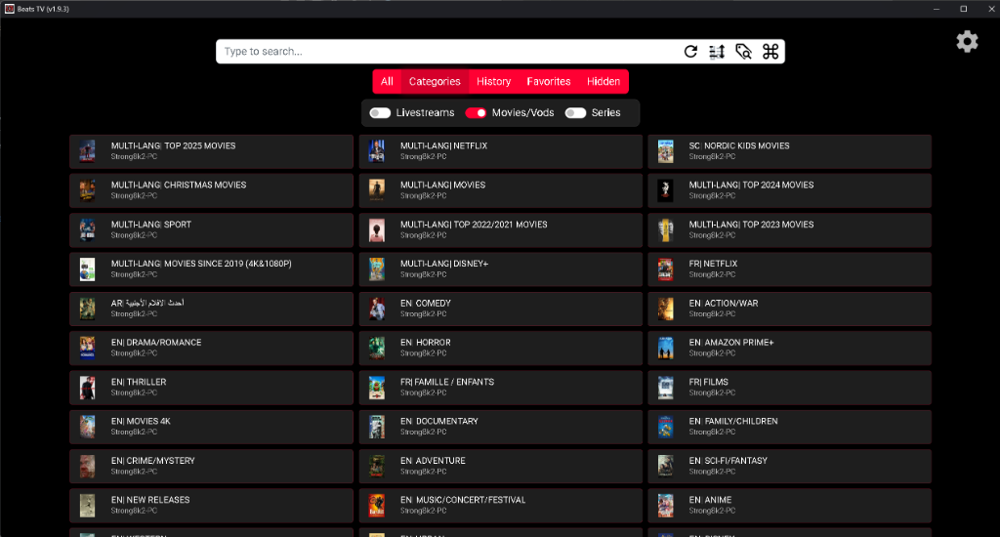

# Beats TV

<p align="center">
  
</p>

Beats TV is a high-performance IPTV experience, carefully crafted to be even speedier and more feature-rich.

## Credits & Inspiration

This project is a fork of the excellent [Open TV](https://github.com/Fredolx/open-tv) project. We give full credit to the original developers of Open TV for their incredible foundation.

**Why this fork exists:**
While Open TV is fantastic, the original maintainers explicitly refuse to accept AI-generated code or contributions assisted by AI. In the spirit of the modern "Vibe Coding" era, we believe that AI is a powerful tool for rapid development and optimization. Beats TV was created to push the boundaries of what's possible using AI-assisted coding to build the ultimate IPTV experience for the Beats PM community and beyond.

## Download & Installation

You can download the latest pre-compiled binaries for Windows, macOS, and Linux directly from the [Releases](https://github.com/Fredolx/open-tv/releases) page.



## Features:

- **AI-Optimized Performance:** Leveraging AI for the fastest possible UI and stream handling.
- **Import Flexible Sources:** M3U File, M3U link, Xtream 🗃️
- **Recording:** Record while watching 🎥
- **Multi-Source Management:** Manage multiple IPTV providers with ease.
- **TV Remote Optimized:** Full control from your couch 📺
- **Ultra-Low Resource Usage:** Minimal RAM usage and instant search 🚅
- **Custom Channels:** Create and share your own channel lists.
- **Re-streaming:** Share your streams to other devices (phone, TV).

## Dependencies

Beats TV requires `mpv`, `ffmpeg`, and `yt-dlp` to function. **Most users don't need to do anything manually:**

| Platform              | Dependency Handling                                              |
| --------------------- | ---------------------------------------------------------------- |
| **Windows (.msi)**    | ✅**Automatic** – All dependencies are bundled in the installer. |
| **Linux (.deb/.rpm)** | ✅**Automatic** – Package managers install dependencies for you. |
| **Flatpak**           | ✅**Automatic** – Sandboxed with all dependencies included.      |
| **macOS**             | ⚠️**Manual** – See below.                                        |

### macOS Users Only

macOS users must install dependencies via [Homebrew](https://brew.sh/) or [MacPorts](https://www.macports.org/):

```bash
# Using Homebrew (recommended)
brew install mpv ffmpeg yt-dlp

# Using MacPorts
sudo port install mpv ffmpeg yt-dlp
```

## Hotkeys

- F1: Help
- Ctrl + a: Show all channels
- Ctrl + s: Show categories
- Ctrl + d: Show favorites
- Ctrl + f: Search
- Ctrl + q: Enable/Disable livestreams
- Ctrl + w: Enable/Disable movies
- Ctrl + e: Enable/Disable series
- Backspace/Esc: Go back
- Arrow keys/Tab/Shift+Tab: Navigation

## Disclaimer

Beats TV is an independent project. While it inherits the core brilliance of Open TV, it is a separate branch designed to embrace AI-driven development. Any resemblance to other products is coincidental. We are not affiliated with the original Open TV team.
